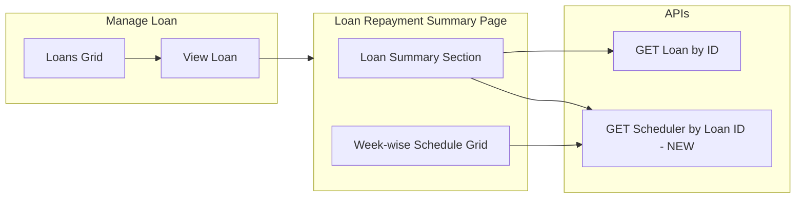

# Loan Repayment Summary (Manage Loan) – Implementation Plan

## User story

**As a** Loan Officer, **I want to** view the complete loan repayment summary and week-wise payment details in a read-only format, **so that** I can track repayment progress, outstanding balance, and payment history without modifying any data.

---

## Overview

This plan is aligned with the existing Manage Loan implementation. When the user clicks **View Loan** on the Manage Loan grid, the **Loan Repayment Summary** page should open and display a read-only view with (1) Loan Summary section (Total Amount Paid, Remaining Balance, Weekly Due) and (2) a week-wise repayment schedule grid. The page reuses `getLoanById`; a new backend API to fetch scheduler/repayment data by loan ID is required for the schedule. The route and component for this page are added under the Manage Loan feature.

---

## Acceptance criteria (requirements alignment)

### Loan Summary Section (Read-Only)

| Field Name           | Data Type     | Field Type     | Mandatory | Validation / Logic |
|----------------------|---------------|----------------|-----------|--------------------|
| Total Amount Paid    | DECIMAL(10,2) | Label (Read-only) | Yes   | Fetched as the cumulative sum of Paid Amount from Recovery Posting and Prepayment modules. |
| Remaining Balance    | DECIMAL(10,2) | Label (Read-only) | Yes   | Calculated as: Total Loan Amount − Total Amount Paid |
| Weekly Due (EMI)     | DECIMAL(10,2) | Label (Read-only) | Yes   | Calculated as: Total Repayable Amount ÷ Payment Term |

### Week-wise Repayment Schedule (Read-Only Grid)

The system shall display repayment details in a tabular format.

| Field Name      | Data Type     | Field Type | Mandatory | Validation / Source |
|-----------------|---------------|------------|-----------|----------------------|
| Week No         | INT           | Label      | Yes       | Sequential number generated based on Payment Term |
| Collection Date | DATE          | Label      | Yes       | Calculated based on Collection Day (from POC), Collection Start Date, and Payment Term (from Add Loan) |
| Paid Date       | DATE          | Label      | No        | Fetched from Recovery Posting & Prepayment Loan page |
| Payment Status  | VARCHAR(20)   | Label      | Yes       | Fetched from Recovery Posting (Values: Paid / Not Paid / Partially Paid) |
| Paid Amount     | DECIMAL(10,2) | Label      | Yes       | Fetched from Recovery Posting |
| Reasons         | VARCHAR(255)  | Label      | No        | Displays reason for non-payment or partial payment |

### Field validation rules

- All fields are **non-editable**; values must match backend transaction records; no manual override allowed.
- If no recovery data exists → show default values (**0** for amounts, **blank** for dates/reasons).
- Decimal values must be rounded to **2 decimal places**.

### Payment Term

- **Not editable** on this UI. Retrieved from Master Data (number of payment terms defined for Weekly / Monthly / Daily; configurable in Master Data), stored with the loan (e.g. `noOfTerms`).

---

## Current state (existing code)

- **Manage Loan** ([manage-loan.page.ts](src/app/pages/manage-loan/manage-loan.page.ts), [manage-loan.page.html](src/app/pages/manage-loan/manage-loan.page.html)):
  - Data from `LoanService.getActiveLoanSummary()` → `GET /api/Loans/activeloansummary`. Grid uses `ActiveLoanSummaryDto[]` (loanId, memberName, totalAmount, noOfTerms, numberOfPaidEmis, totalPaidAmount, totalUnpaidAmount).
  - Grid columns: Member Name, Total Amount, No. of Weeks Paid, Total Amount Paid, Remaining Balance, **Actions** (View Loan, Prepayment Loan). Grid uses `[context]="gridContext"` so action buttons work.
  - **View Loan** navigates to `/manage-loan/repayment-summary/:id`. **Prepayment Loan** navigates to `/preclose-loan` with queryParams (loanId, memberName).
  - Search filters: First Name, Surname, Loan ID.
- **Routing**: [manage-loan-routing.module.ts](src/app/pages/manage-loan/manage-loan-routing.module.ts) has only `path: ''` → `ManageLoanComponent`. The path **repayment-summary/:loanId** is **not defined**—the Loan Repayment Summary page does not exist yet.
- **APIs**: [loan.service.ts](src/app/services/loan.service.ts): `getLoanById(loanId)`, `getActiveLoanSummary()`. No API to fetch scheduler/repayment by loanId. [recovery-posting.service.ts](src/app/services/recovery-posting.service.ts): `getLoanSchedulersForRecovery(filter)` uses scheduleDate, branchId, centerId, pocId—no loanId.
- **Models**: [loan.models.ts](src/app/models/loan.models.ts): `ActiveLoanSummaryDto`, `Loan` (totalAmount, noOfTerms, collectionStartDate, collectionTerm, memberId; no POC/collection day on Loan). [recovery-posting.models.ts](src/app/models/recovery-posting.models.ts): `LoanSchedulerRecoveryDto` (scheduleDate, installmentNo, status, actualEmiAmount, comments; no paidDate in frontend DTO).
- **POC / Collection Day**: [poc.service.ts](src/app/services/poc.service.ts) `Poc` has `collectionDay`, `collectionFrequency`. Add Loan ([add-loan-modal.component.ts](src/app/pages/add-loan/add-loan-modal.component.ts)) loads member's POC and validates Collection Start Date against POC's Collection Day. For repayment summary, collection dates can be derived from Loan (collectionStartDate, noOfTerms) + POC (collectionDay) via member's POC.

---

## Target behaviour

- **When the user clicks View Loan**, the **Loan Repayment Summary** page should open and display:
  - **Loan Summary**: Total Amount Paid, Remaining Balance, Weekly Due (EMI)—all read-only, decimals to 2 places.
  - **Week-wise grid**: Week No, Collection Date, Paid Date, Payment Status, Paid Amount, Reasons—all read-only; no recovery data → show 0/blank as per spec.
  - **Back** button to return to Manage Loan list.
- Collection dates: first date matches POC Collection Day; subsequent dates by payment frequency (e.g. weekly); total rows = Payment Term.

### Detailed business logic (from requirement)

1. **Collection date calculation**  
   Uses: Collection Day (POC), Collection Start Date (Add Loan), Payment Term (from Master Data). First collection date must match POC Collection Day; subsequent dates generated weekly (or by payment frequency: weekly/monthly/daily). Total number of rows = Payment Term.

   *Example:*

   | Week | Collection Date |
   |------|------------------|
   | 1    | Jan-11           |
   | 2    | Jan-18           |
   | 3    | Jan-25           |
   | 4    | Feb-01           |
   | 5    | Feb-08           |
   | 6    | Feb-15           |

   (Collection Day = Saturday, Collection Start Date = Jan-11, Payment Term = 6 weeks.)

2. **Paid date**  
   Fetched from Recovery Posting and Prepayment Loan module. If no payment exists → remain blank.

3. **Payment status**  
   Fetched from Recovery Posting. Allowed values: **Paid**, **Not Paid**, **Partially Paid**.

4. **Paid amount**  
   Fetched from Recovery Posting. Paid → equals Weekly Due; Not Paid → 0; Partially Paid → less than Weekly Due.

5. **Total amount paid**  
   Total Amount Paid = Sum of Paid Amount for all weeks. *Example:* Week 1 = 1000, Week 2 = 0, Week 3 = 500 → Total Amount Paid = 1500.

6. **Remaining balance**  
   Remaining Balance = Total Loan Amount − Total Amount Paid. *Example:* Loan Amount = 120000, Total Paid = 40000 → Remaining Balance = 80000.

---

## Architecture

---

## 1. Backend (required; scope as needed)

Backend is not in this workspace; these items are for the API team or a separate backend repo.

- **New endpoint** (choose one pattern):
  - **Option A**: `GET /api/LoanSchedulers/by-loan/{loanId}` — returns a list of schedule rows for that loan.
  - **Option B**: `GET /api/Loans/{loanId}/repayment-summary` — returns a single DTO with summary + schedule rows (cleaner for the UI).
- **Response shape (per schedule row)**: Week No, Collection Date, Paid Date (nullable), Payment Status, Paid Amount, Reasons.
- **Summary fields**: Total Amount Paid, Remaining Balance, Weekly Due (EMI)—can be computed on backend or frontend from loan + schedule rows.
- **Data source**: Reuse existing Loan Scheduler / Recovery entities. Ensure **Paid Date** is stored when recovery is posted and exposed in this response.
- **Collection date logic**: First collection date matches POC Collection Day; then add one period per term; total rows = Payment Term. Current recovery API is date + branch/center/poc only (no loanId).

If backend only adds scheduler-by-loan (list of rows), the frontend can compute Total Amount Paid, Remaining Balance, and Weekly Due from `getLoanById` + this list.

### Backend API checklist and troubleshooting

**Endpoint the frontend calls:** `GET /api/LoanSchedulers/loan/{loanId}` (used by Loan Repayment Summary).

| Requirement | Detail |
|------------|--------|
| **Route** | `GET api/LoanSchedulers/loan/{loanId}` — returns **only** schedulers for that `loanId`. |
| **Response** | JSON array of objects (or `{ $values: [...] }`). Empty array `[]` when no rows. |
| **Table** | `LoanSchedulers`: filter by `LoanId = {loanId}`; order by `InstallmentNo` (or `ScheduleDate`). |
| **Fields used** | At least: `loanSchedulerId`, `loanId`, `scheduleDate`, `paymentDate`, `installmentNo`, `paymentAmount`, `status`, `comments`. Dates can be ISO or `YYYY-MM-DD HH:mm:ss...`. |
| **Why API may fail** | (1) Route not implemented — implement `GET loan/{loanId}` and return rows from `LoanSchedulers` where `LoanId = loanId`. (2) Wrong route name — frontend uses `loan/{id}`, not `by-loan/{id}`. (3) CORS/auth — same as other LoanSchedulers endpoints. (4) Serialization — return plain array or OData-style `$values`; frontend accepts both. |

**Recovery posting (separate flow):** `GET /api/LoanSchedulers/recovery` with query params `scheduleDate`, `branchId`, `centerId`, `pocId`, etc. Backend method e.g. `GetLoanSchedulersForRecoveryAsync` should filter by those params and return list of scheduler DTOs (with member/center/poc names for the grid). No change needed for Loan Repayment Summary; keep both endpoints.

**Unnecessary:** Do not add extra filters (e.g. date range) to `GET loan/{loanId}`; the frontend only needs all schedulers for one loan.

---

## 2. Frontend – New page and route (under Manage Loan)

- **View Loan** already navigates to `/manage-loan/repayment-summary/:id`. The following are **missing** and must be added:
  - **Route**: In [manage-loan-routing.module.ts](src/app/pages/manage-loan/manage-loan-routing.module.ts), add a child route `repayment-summary/:loanId` (full URL: `/manage-loan/repayment-summary/:loanId`).
  - **Component**: New **Loan Repayment Summary** page under `src/app/pages/manage-loan/loan-repayment-summary/` (TS, HTML, SCSS), declared in the Manage Loan module.
- No change to the Manage Loan grid or viewLoan navigation target; the Actions column is already present.

---

## 3. Frontend – Data loading and models

- **Reuse**: `LoanService.getLoanById(loanId)` for loan fields (totalAmount, noOfTerms, collectionStartDate, etc.).
- **New**: Service method to call the new backend API when available, e.g. `getRepaymentSummaryByLoanId(loanId)` or `getSchedulerByLoanId(loanId)`.
- **Models**: Summary (totalAmountPaid, remainingBalance, weeklyDue); schedule row (weekNo, collectionDate, paidDate?, paymentStatus, paidAmount, reasons?). If the backend does not expose collection date, the frontend can compute it using loan + POC (member's POC) per Add Loan pattern.

---

## 4. Frontend – UI (read-only)

- **Loan Summary section**: Total Amount Paid, Remaining Balance, Weekly Due (EMI)—labels with values, `toFixed(2)`.
- **Week-wise grid**: Read-only table (AG Grid or HTML). Columns: Week No, Collection Date, Paid Date, Payment Status, Paid Amount, Reasons. No recovery → Paid Date blank, Paid Amount 0, Reasons blank.
- **Back**: Button to navigate to `/manage-loan`.

---

## 5. Reuse and non-breaking changes

- Existing APIs unchanged. New API is additive (by loanId). Manage Loan: only additive (new child route + component); viewLoan and Actions column already in place.

---

## 6. Implementation order (suggested)

1. **Backend**: Add GET scheduler/repayment by loanId (with collection date, paid date, status, paid amount, reasons); optionally include summary fields.
2. **Frontend**: Add child route `repayment-summary/:loanId` and new page component in `src/app/pages/manage-loan/loan-repayment-summary/`; add service method and models for the new API.
3. **Frontend**: Implement summary section and week-wise grid (read-only); format decimals and dates; handle loading and no-data; Back button.
4. **View Loan**: Already points to repayment-summary; no code change needed once route and component exist.

---

## 7. Clarifications (optional)

- **Total Loan Amount vs Total Repayable Amount**: In loan.models.ts, `totalAmount` is the repayable. If both formulas use the same base, use Remaining Balance = totalAmount − Total Amount Paid and Weekly Due = totalAmount ÷ noOfTerms. Confirm with product if "Total Loan Amount" means principal only.
- **Prepayment**: Confirm with backend that prepayment data is included in the by-loan API (total paid and paid date per installment).
