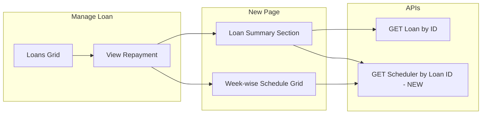

# Loan Repayment Summary (Manage Loan) – Implementation Plan

## User story

**As a** Loan Officer, **I want to** view the complete loan repayment summary and week-wise payment details in a read-only format, **so that** I can track repayment progress, outstanding balance, and payment history without modifying any data.

---

## Overview

Add a read-only Loan Repayment Summary view under Manage Loan: a new page showing Total Amount Paid, Remaining Balance, Weekly Due (EMI), and a week-wise repayment grid. Reuse getLoanById; add a new backend API to fetch scheduler/repayment data by loan ID; add route and UI entry from the Manage Loan grid.

---

## Acceptance criteria (requirements alignment)

### Loan Summary Section (read-only)

| Field Name           | Data Type     | Field Type     | Mandatory | Validation / Logic |
|----------------------|---------------|----------------|-----------|--------------------|
| Total Amount Paid    | DECIMAL(10,2) | Label (read-only) | Yes   | Cumulative sum of Paid Amount from **Recovery Posting** and **Prepayment** modules. |
| Remaining Balance    | DECIMAL(10,2) | Label (read-only) | Yes   | **Total Loan Amount** − Total Amount Paid. |
| Weekly Due (EMI)     | DECIMAL(10,2) | Label (read-only) | Yes   | **Total Repayable Amount** ÷ Payment Term. |

### Week-wise Repayment Schedule (read-only grid)

| Field Name      | Data Type     | Field Type | Mandatory | Validation / Source |
|-----------------|---------------|------------|-----------|----------------------|
| Week No         | INT           | Label      | Yes       | Sequential number based on Payment Term. |
| Collection Date | DATE          | Label      | Yes       | From POC Collection Day, Collection Start Date, and Payment Term (Add Loan). |
| Paid Date       | DATE          | Label      | No        | From Recovery Posting & Prepayment; blank if no payment. |
| Payment Status  | VARCHAR(20)   | Label      | Yes       | From Recovery Posting: **Paid** / **Not Paid** / **Partially Paid**. |
| Paid Amount     | DECIMAL(10,2) | Label      | Yes       | From Recovery Posting. Paid = Weekly Due; Not Paid = 0; Partially Paid &lt; Weekly Due. |
| Reasons         | VARCHAR(255)  | Label      | No        | Reason for non-payment or partial payment. |

### Field validation rules

- All fields are **non-editable**; values must match backend transaction records; no manual override.
- If no recovery data exists → show default values (**0** for amounts, **blank** for dates/reasons).
- Decimal values rounded to **2 decimal places**.

### Payment Term

- **Not editable** on this UI. Retrieved from Master Data (number of payment terms for Weekly / Monthly / Daily; configurable in Master Data), stored with the loan (e.g. `noOfTerms`).

---

## Current state

- **Manage Loan** ([manage-loan.page.ts](../src/app/pages/manage-loan/manage-loan.page.ts)): Shows an AG Grid of loans for the selected branch. `viewLoan(loan)` navigates to `/loan-detail/:id`, but **no such route exists** in app-routing.module.ts.
- **APIs**: `LoanService.getLoanById(loanId)` and `getLoansByBranch(branchId)` exist. Recovery data is fetched via `getLoanSchedulersForRecovery(filter)` with **date + branch/center/poc** (no loanId), so scheduler rows for a **single loan** are not available today.
- **Loan model** ([loan.models.ts](../src/app/models/loan.models.ts)): Has `totalAmount`, `noOfTerms`, `collectionStartDate`, `collectionTerm`, `memberId`. No POC/collection day on Loan.
- **Recovery DTO** ([recovery-posting.models.ts](../src/app/models/recovery-posting.models.ts)): `LoanSchedulerRecoveryDto` has `scheduleDate`, `installmentNo`, `status`, `actualEmiAmount`, `comments`; **Paid Date** is not in the frontend DTO (may exist on backend when recovery is posted).
- **Prepayment**: No prepayment module in the frontend; if it exists only in backend, total paid/paid date logic can be extended there.

---

## Target behaviour

- From **Manage Loan**, user opens a **read-only Repayment Summary** for one loan.
- **Loan Summary**: Total Amount Paid (sum of paid amounts), Remaining Balance (Total Loan Amount − Total Amount Paid), Weekly Due (Total Repayable ÷ Payment Term). All read-only, decimals to 2 places.
- **Week-wise grid**: Week No, Collection Date, Paid Date, Payment Status, Paid Amount, Reasons. All read-only; no recovery data → show 0/blank as per spec.
- **Collection dates**: First date matches POC Collection Day; subsequent dates by payment frequency (e.g. weekly); count = Payment Term.

### Detailed business logic (from requirement)

1. **Collection date calculation**  
   Uses: Collection Day (POC), Collection Start Date (Add Loan), Payment Term (from Master Data). First collection date must match POC Collection Day; subsequent dates generated weekly (or by payment frequency: weekly/monthly/daily). Total number of rows = Payment Term.  
   *Example:* Collection Day = Saturday, Collection Start Date = Jan-11, Payment Term = 6 → Week 1 = Jan-11, Week 2 = Jan-18, Week 3 = Jan-25, … Week 6 = Feb-15.

2. **Paid date**  
   Fetched from Recovery Posting and Prepayment Loan module. If no payment exists → leave blank.

3. **Payment status**  
   Fetched from Recovery Posting. Allowed values: **Paid**, **Not Paid**, **Partially Paid**.

4. **Paid amount**  
   Fetched from Recovery Posting. Paid → equals Weekly Due; Not Paid → 0; Partially Paid → less than Weekly Due.

5. **Total amount paid**  
   Sum of Paid Amount for all weeks (including from Prepayment if applicable). *Example:* Week 1 = 1000, Week 2 = 0, Week 3 = 500 → Total Amount Paid = 1500.

6. **Remaining balance**  
   Total Loan Amount − Total Amount Paid. *Example:* Loan Amount = 120000, Total Paid = 40000 → Remaining Balance = 80000.

---

## Architecture

---

## 1. Backend (required; scope as needed)

Backend is not in this workspace; these items are for the API team or a separate backend repo.

- **New endpoint** (choose one pattern):
  - **Option A**: `GET /api/LoanSchedulers/by-loan/{loanId}`  
  Returns a list of schedule rows for that loan.
  - **Option B**: `GET /api/Loans/{loanId}/repayment-summary`  
  Returns a single DTO with summary + schedule rows (cleaner for the UI).
- **Response shape (per schedule row)**:
  - **Week No**: Sequential (e.g. 1..Payment Term); can be `installmentNo` or derived.
  - **Collection Date**: Computed from POC Collection Day + Loan Collection Start Date + term index (weekly/monthly/daily as per Payment Term).
  - **Paid Date**: From Recovery Posting and Prepayment; nullable when not paid (requirement: blank if no payment).
  - **Payment Status**: From Recovery Posting. Values: Paid / Not Paid / Partially Paid.
  - **Paid Amount**: From Recovery Posting. Paid = Weekly Due; Not Paid = 0; Partially Paid &lt; Weekly Due.
  - **Reasons**: Comments/reason for non-payment or partial payment (e.g. `comments` from scheduler).
- **Summary fields** (can be computed on backend or frontend):
  - **Total Amount Paid**: Cumulative sum of Paid Amount from **Recovery Posting and Prepayment** (all installments). Requirement: same source as acceptance criteria.
  - **Remaining Balance**: **Total Loan Amount** − Total Amount Paid (requirement wording; confirm with product whether this is principal-only or total repayable).
  - **Weekly Due (EMI)**: **Total Repayable Amount** ÷ Payment Term (e.g. `loan.totalAmount / loan.noOfTerms`).
- **Data source**: Reuse existing Loan Scheduler / Recovery entities. Ensure **Paid Date** is stored when recovery is posted and exposed in this response.
- **Collection date logic**: Implement per spec: first collection date matches POC Collection Day; then add one period (week/month/day) per term; total rows = Payment Term. POC's Collection Day is available via Member → POC (or denormalized on Loan/Scheduler).

If backend only adds **scheduler-by-loan** (list of rows with paid date, status, paid amount, comments, collection date), the frontend can compute Total Amount Paid, Remaining Balance, and Weekly Due from `getLoanById` + this list.

---

## 2. Frontend – New page and route (under Manage Loan)

- **New page**: **Loan Repayment Summary** implemented **under the Manage Loan page**:
  - **Folder**: `src/app/pages/manage-loan/loan-repayment-summary/` (sibling to manage-loan.page.ts within the manage-loan feature).
  - **Component**: e.g. `LoanRepaymentSummaryComponent` (TS, HTML, SCSS); declared in the Manage Loan module or a shared sub-module.
- **Route**: Add a **child route** of Manage Loan in manage-loan-routing.module.ts:
  - Path: `repayment-summary/:loanId` (full URL: `/manage-loan/repayment-summary/:loanId`).
  - No new top-level app route; the repayment summary is part of the Manage Loan feature.
- **Navigation**: Update `viewLoan` in manage-loan.page.ts to navigate to `manage-loan/repayment-summary/${id}` (or relative `repayment-summary/${id}` when already on manage-loan) instead of `loan-detail/:id`.
- **Entry from grid**: The current Manage Loan grid does not show a "View" button in the template; column defs have no action column. Add either:
  - An **action column** with a "View" or "Repayment Summary" button that calls `viewLoan(params.data)`, or
  - **Row double-click** in `gridOptions` to call `viewLoan(params.data)`.

---

## 3. Frontend – Data loading and models

- **Reuse**: `LoanService.getLoanById(loanId)` to get `totalAmount`, `noOfTerms`, and any other loan fields.
- **New**: Service method to call the new backend API, e.g.:
  - `getRepaymentSummaryByLoanId(loanId): Observable<RepaymentSummaryDto>` (if backend returns summary + rows), or
  - `getSchedulerByLoanId(loanId): Observable<LoanSchedulerRowDto[]>` (if backend returns only rows).
- **Models**: Define a small model (or reuse/extend existing) for the repayment summary response, e.g.:
  - Summary: `totalAmountPaid`, `remainingBalance`, `weeklyDue` (all number).
  - Row: `weekNo`, `collectionDate`, `paidDate` (optional), `paymentStatus`, `paidAmount`, `reasons` (optional).

If the backend does not expose **collection date** and only returns raw scheduler rows, the frontend can compute collection dates using:

- `loan.collectionStartDate`,
- `loan.noOfTerms`,
- POC `collectionDay` (fetched via member's POC by `loan.memberId`),
and the same weekly/monthly/daily logic as the spec. Prefer backend-computed collection dates to avoid duplication and timezone/calendar edge cases.

---

## 4. Frontend – UI (read-only)

- **Loan Summary section** (labels only):
  - Total Amount Paid: value from API or sum of `paidAmount` from schedule rows; format `toFixed(2)`.
  - Remaining Balance: from API or `loan.totalAmount - totalAmountPaid`; `toFixed(2)`.
  - Weekly Due (EMI): from API or `loan.totalAmount / loan.noOfTerms`; `toFixed(2)`.
- **Week-wise grid**: Read-only table (AG Grid or simple HTML table). Columns: Week No, Collection Date, Paid Date, Payment Status, Paid Amount, Reasons. No editing; empty/no recovery → Paid Date blank, Paid Amount 0, Reasons blank as per spec.
- **Defaults**: When there is no recovery data, show 0 for amounts and blank for dates/reasons.
- **Back**: Button or header link to return to Manage Loan list (navigate to `/manage-loan` or parent route).

---

## 5. Reuse and non-breaking changes

- **Existing APIs**: `getLoanById` and `getLoansByBranch` remain unchanged. Recovery posting flow and `getLoanSchedulersForRecovery` remain unchanged; the new API is additive (by loanId).
- **Manage Loan**: Only additive changes: new **child** page and route under manage-loan (`repayment-summary/:loanId`), optional action column or double-click to open summary; `viewLoan` navigates to the new child route. No change to existing columns or branch/loan loading.
- **Prepayment**: If prepayment exists only in backend, include it in the new "by-loan" API (total paid + paid date). Frontend just displays what the API returns.

---

## 6. Implementation order (suggested)

1. **Backend**: Add GET scheduler/repayment by loanId (with collection date, paid date, status, paid amount, reasons); optionally include summary fields.
2. **Frontend**: Under Manage Loan, add child route `repayment-summary/:loanId` and new page in `src/app/pages/manage-loan/loan-repayment-summary/`; add service method and models for the new API.
3. **Frontend**: Implement summary section and week-wise grid (read-only); format decimals and dates; handle loading and no-data.
4. **Frontend**: Point `viewLoan` to the new route; add "View"/"Repayment Summary" action column or row double-click on Manage Loan grid.

---

## 7. Clarifications (optional)

- **Total Loan Amount vs Total Repayable Amount**: Requirement explicitly uses **"Total Loan Amount"** for Remaining Balance and **"Total Repayable Amount"** for Weekly Due. In loan.models.ts, `totalAmount` is the repayable (loan + interest etc.); `loanAmount` is principal. If both formulas use the same base (e.g. total repayable), use **Remaining Balance = totalAmount − Total Amount Paid** and **Weekly Due = totalAmount ÷ noOfTerms**. If "Total Loan Amount" means principal only, Remaining Balance would use `loanAmount`; confirm with product.
- **Prepayment**: Requirement states Total Amount Paid and Paid Date are from **Recovery Posting and Prepayment**. Confirm with backend that prepayment data is included in the by-loan API (total paid and paid date per installment).
